# Database

This project runs with [MongoDB](https://www.mongodb.com) in [Atlas](https://cloud.mongodb.com/) as the backend database. It consumes data using [Realm GraphQL API Integration](https://docs.mongodb.com/realm/graphql/) We are going to recreate it together. 

## Create an Atlas Sandbox (M0 Tier Cluster)

The first thing we need to do is to create a cluster in MongoDB Atlas. A Sandbox cluster is free for ever and you don't need to add a credit card or any other payment information. We have to go to [MongoDB Atlas](https://cloud.mongodb.com/), register with an email and password, and once we're logged in, we have to create an Organization and Project. Then we can deploy our cluster, selecting the "Free Tier"


## Security

Now your cluster is deployed, you will need to add a user for it. Go to the Security link in the left sidebar menu, and create a new user. 

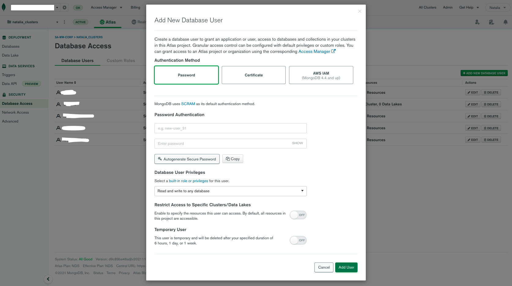

You now also need to go to 'Network Access', and add your current IP.

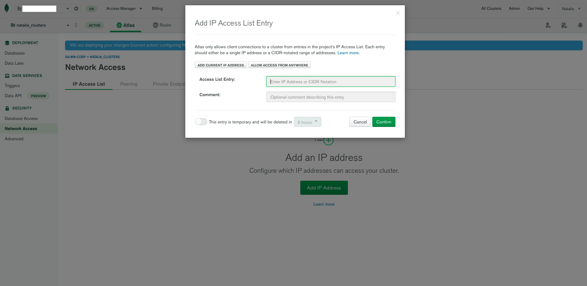

## Installing the Mongo Shell and Compass

Before we can start, we will need some additional tools. Please make sure to install MongoShell, according to the instructions for your particular system. You can find all instructions by clicking in 'Connect', like shown in the image, and selecting "With MongoShell". If you click on the "I don't have MongoShell" installed tab, it will give you all instructions for your OS.


To import data using the shell, you will need the MongoDB Database [Tools](https://docs.mongodb.com/database-tools/), so you can execute utilities like [mongoimport](https://docs.mongodb.com/database-tools/mongoimport/#mongodb-binary-bin.mongoimport)

If you prefer, you can also use [MongoDB Compass](https://www.mongodb.com/products/compass)
our GUI for working with MongoDB data

## Loading a test data-set 

We will also need to load some data. We could use the 'Load Sample Data' option directly in the Atlas UI, but for this particular app, we will use data generated with [mgeneratejs](https://github.com/rueckstiess/mgeneratejs)

I generated [this data](./database_exports/tattonetwork) with the schemas you can find in the [schema](./schema) folder. 
Now that you have the Mongo Shell and the tools installed, you can use [these commands](./database_exports/commands.md) to import them to your cluster. *Please do not import the 'ratings.json' to a ratings collection for now! Only import 'artists' and 'opinions'*

You will be able to do it if you followed the instructions for security above, by replacing the username and password with the ones you created for your user, and the clustername with your clustername. You will also need to replace the id, with the one of your cluster. You can get all this information from the 'connection string' for your cluster, by going to the button 'Connect', selecting Mongoshell, and copying the string

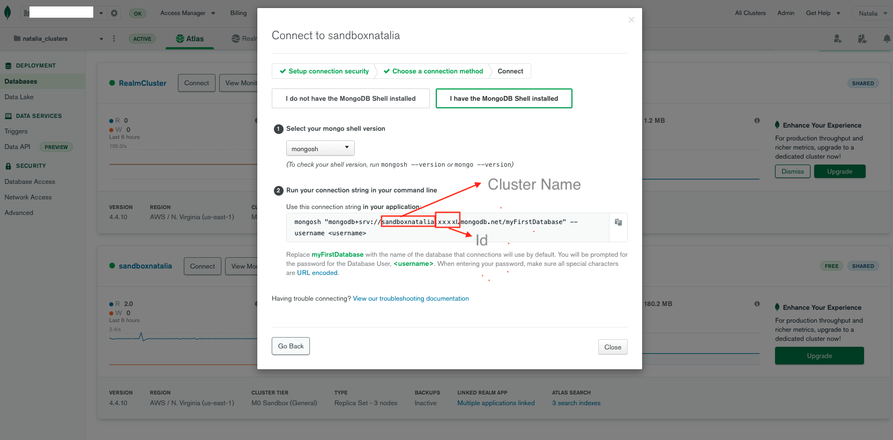

# Creating a Realm App

Before we can start, we will need to create a MongoDB Realm app in Atlas. To do that, we have to go to the Realm tab on the top menu, and select `Create New App`. We will configure our app giving it a name and linking it to our cluster. The rest of configurations can stay as per the defaults.

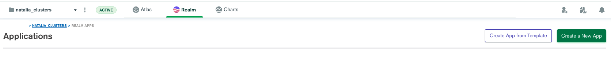
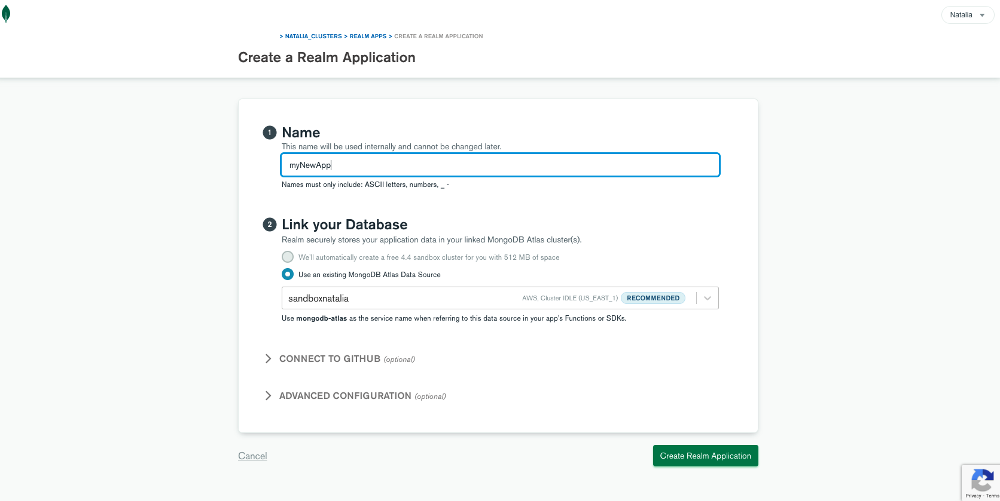

## Reviewing and deploying changes

*Important: When you're working in Realm, any changes you make need to be reviewed and deployed to be effective*
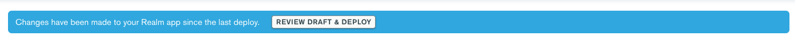


## Configure App Rules and Access

What we will do next, is throughly described in the [following documentation](https://docs.mongodb.com/realm/graphql/expose-data/), and are pre-requirements to expose data.

We will go to the `Authentication` tab on the left sidebar menu and enable the `Allow users to login anonymously` in the `Authentication providers` tab, so the `Enabled` status is set to `On`.

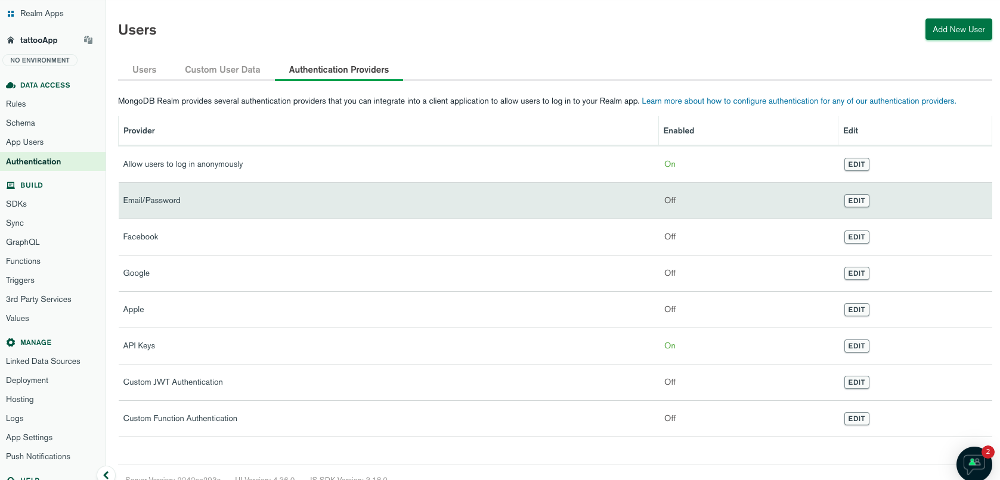

Now we will head t the `Rules`tab on the left sidebar menu, and configure collection pemissions for our `artists` and `opinions` collection. We can select the the `Users can read all data but only write their own data` template from the pulldown.

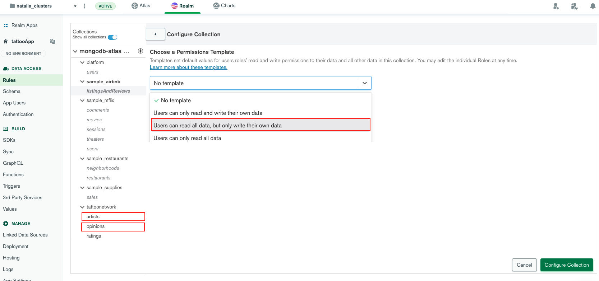

Now we will have something like this:


### Application

At an application level, we are passing custom session tokens to our app, via the Apollo module configuration. You can see it in [his file](./atlas-tattoo-app/src/app/graphql.module.ts)

To complete this configuration, we will need the id of our application. We can find it by going to our App page in Realm, and finding the App ID field. You will have to replace the ID with yours in that file!

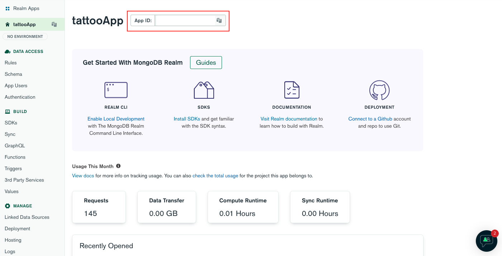

You will also need to get and configure your GraphQL API endpoint in this file!

## Generate the schema for each collection

Now we have the permissions configured, the next thing we need to do, is generate a schema for our collections. This is how the [GraphQl](https://graphql.org/) server under the hood, will automatically generate types and resolvers.

The schema is generated from the fields and values in your documents. 

One special case is the `artists` collection schema, that we will need to edit manually, and it will need to look like [this](./schema/special_case/schema_artists_bson.json)

## Relationship

Additionally, in our case, we will create a relationship between the `artists` and the `opinions` collections. For that, we will go to the `Relationships` tab in the `artists` collection, and add this code:

```
{
  "artist_id": {
    "ref": "#/relationship/mongodb-atlas/tattoonetwork/opinions",
    "foreign_key": "artist_id",
    "is_list": false
  }
}
```

You can also find this snippet in [here](./relationship/relationship.json)

# GraphQL

## Schema

Now we've done all this, we can go take a look at the schema GraphQl has generated for us. Amazing isn't it! We did not have to figure all that out. We have [queries and mutations](https://graphql.org/learn/queries/) we can start querying in the integrated [GraphiQL](https://graphql.org/learn/serving-over-http/#graphiql) interface, right away!

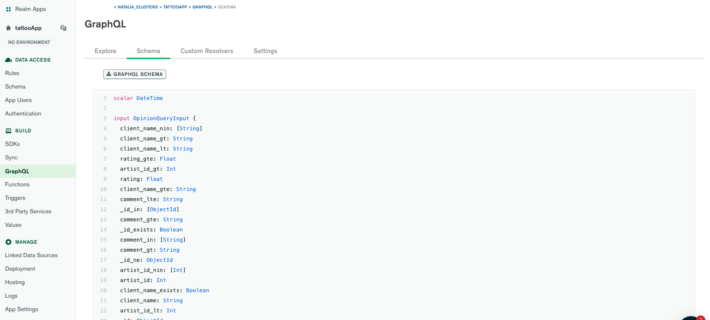

However, this won't help us achieve what we want with this app. In order to use the [aggregation framework](https://docs.mongodb.com/manual/aggregation/) and query data and get the results we expect, we will need to add a few [custom resolvers](https://docs.mongodb.com/realm/graphql/custom-resolvers/)

## Custom Resolvers

We are going to start by creating our first three custom resolver. One will help us get the autocomplete done. The other one will help us query our data. And the third one, will help us query the opinions about our particular tattoo artists.

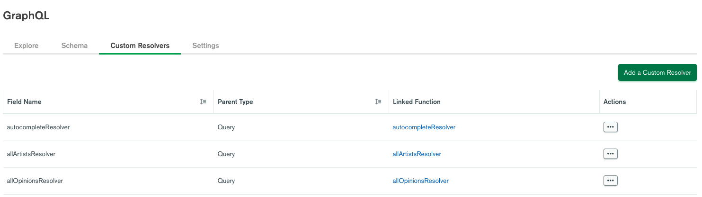

Resolvers can be configured by setting up the GraphQl Field Name, the parent Type (in our case will always be Query), the function, the input type, and the payload type.

But before we start, we will do another important thing. Given we will be using aggregation and the `$search` operator for our first aggregation stage, we will have to create [Search Indexes](https://docs.atlas.mongodb.com/reference/atlas-search/create-index/)

Search Indexes are used by the underlying [Apache Lucene](https://lucene.apache.org/) engine, to run performant full-text search queries!

## Search Indexes

To create `Search Indexes`, we need to go to the `Atlas` tab on the top bar menu, and then go to our cluster, click on `Browse Collections`, select the collection we will index (in this case `artists`) and finally, click on the `Search` tab, on top of the collections browser.

We can either use the Visual editor, or the JSON editor.

*Info: Free Tier M0 Atlas Cluster has a maximum search Indexes of 3*

## Default Search Index

The first thing we need to set, is a default, dynamic search index. This index will use all the default settings, and index all common types for the fields in a collection. You can just leave the default settings and hit on `Create Index`. 

### Autocomplete

For our autocomplete resolver, we will create an autocomplete index called `names`! We will use the JSON editor in this case, and for that, we will need to paste this snippet.

```
{
  "mappings": {
    "dynamic": false,
    "fields": {
      "name": {
        "maxGrams": 10,
        "minGrams": 3,
        "type": "autocomplete"
      }
    }
  }
}
```

You can also find the snippet [here](./searchIndexes/autocompleteType.json)

## Autocomplete Resolver

Now we can proceed to create the custom resolvers. For that we go back to `Realm > Tattoo-App > GraphQL > Custom Resolvers` and click on `Add a Custom Resolver`.

We will start by the autocomplte. Rememeber we will be using the autocomplete index called `names`.

This is what the configuration will look like:

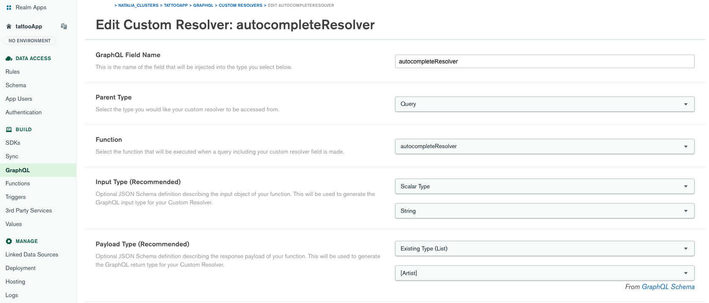

| Config Key | Value |
| --- | ----------- |
| GraphQL Field Name | autocompleteResolver |
| Parent Type | Query |
| Function | New: `autocompleteResolver` *|
| Input Type | Scalar Type > String |
| Payload Type |  Existing Type (List) [ Artist ] |


*Function: We will create a new function and call it `autocompleteResolver`, too. We will write that code in a moment.


### autocompleteResolver Function

Now this resolver will run a serverless function with an aggregation pipeline. You can find the function code, [here](./customResolvers/autocompleteResolver/autocompleteResolver.js)

### Testing our autocompleteResolver

Once we have completed the configuration, we can go to the GraphiQL explorer, and run this query.

```
  query {
    autocompleteResolver(input: "Dan") {
      name
    }
  }
```

That's what you'd get in the application, as autocomplete suggestions, in your search field!

You can find the code in [this file](./queries/autocompleteQuery.js)

## All Artists Resolver

Now we have the autocomplete, we will create a custom resolver for our artists query. We go back to `Realm > Tattoo-App > GraphQL > Custom Resolvers` and click on `Add a Custom Resolver`.

This resolver is a bit more complex, because it will take a custom input. This is what the configuration will look like:

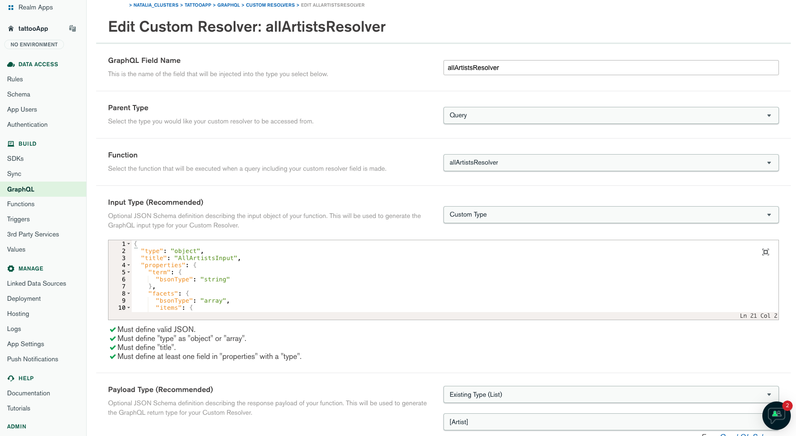

| Config Key | Value |
| --- | ----------- |
| GraphQL Field Name | allArtistsResolver |
| Parent Type | Query |
| Function | New: `allArtistsResolver`|
| Input Type | Custom Type |
| Payload Type |  Existing Type (List) [ Artist ] |

*When we declare a custom type, we need to define a schema to describe it* In our case the JSON will look like this

```
{
  "type": "object",
  "title": "AllArtistsInput",
  "properties": {
    "term": {
      "bsonType": "string"
    },
    "facets": {
      "bsonType": "array",
      "items": {
        "bsonType": "string"
      }
    },
    "country": {
      "bsonType": "string"
    },
    "rating": {
      "bsonType": "decimal"
    }
  }
}
```
You can find this snippet in [this file](./customResolvers/allArtistsInput.json) and more information on BSON types [here](https://docs.mongodb.com/manual/reference/bson-types/)


### allArtistsResolver Function

This resolver will also run a serverless function with an aggregation pipeline. You can find [the function code, here](./customResolvers/allArtistsResolver/allOpinionsResolver.js))

### Testing our allOpinionsResolver

Once we have completed the configuration, we can go to the GraphiQL explorer, and run this query.

```
query {
  allArtistsResolver(input: {term: "Daniel"}) {
    name
    styles
  }
}

query {
  allArtistsResolver(input: {term: "Curtis Becker"}) {
    name
    styles
  }
}
```

As you can see, now we're passing an object, that maps to our custom input type schema!

You can find the code in [this file](./queries/allArtistsQuery.js)

## All Opinions Resolver

Now we have yet a third custom resolver to configure. When we go to an artist's detail page, we want to get all Opinions about this artist. Those opinions are in a different collection. Our `opinions` collection. This is why we previously created a `Relationship` between both collections. We make sure to go back to `Realm > Tattoo-App > GraphQL > Custom Resolvers` and click on `Add a Custom Resolver`.

This is what the configuration will look like:

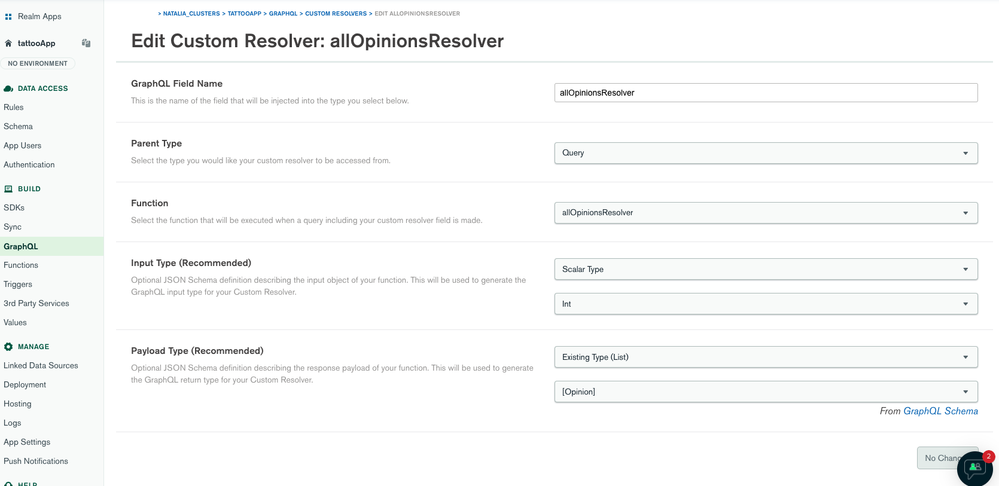

| Config Key | Value |
| --- | ----------- |
| GraphQL Field Name | allOpinionsResolver |
| Parent Type | Query |
| Function | New: `allOpinionsResolver` *|
| Input Type | Scalar Type > String |
| Payload Type |  Existing Type (List) [ Opinion ] |


But wait! We need an index, don't we? Yes. We never created the `Search Index`for the Opinions collection, and we will do so now.

### Opinions Search Index

For our opinions resolver, we will create an  index called `opinions` in our `opinions` collection. We will use the JSON editor in this case, and for that, we will need to paste this snippet.

```
{
  "mappings": {
    "dynamic": false,
    "fields": {
      "artist_id": {
        "type": "number"
      }
    }
  }
}
```
You can find this [snippet](./searhIndexes/opinionsIndex.json)

### allOpinionsResolver Function

This resolver will also run a serverless function with an aggregation pipeline. You can find the function code, [here](./customResolvers/allOpinionsResolver/allOpinionsResolver.js)

### Testing our autocompleteResolver

Once we have completed the configuration, we can go to the GraphiQL explorer, and run this query.

```
query {
  allOpinionsResolver(input: 765) {
    client_name
    comment
  }
}
```

As you can see, now we're passing an object, that maps to our custom input type schema!

You can find the code in [this file](./queries/allOpinionsQuery.js)

## Calculating an average rating

Now if you take a look at the data returned by the opinions query, you will see that there is a rating. This is a score that the clients gave to their commissioned artist. 

We want to calculate the average rating and we will use MongoDB for that! And we will do it while learning how to do a [$lookup](https://docs.mongodb.com/manual/reference/operator/aggregation/lookup/), an equivalent of a left outer join, between two tables, between two MongoDB collections. We will also use the [$out](https://docs.mongodb.com/manual/reference/operator/aggregation/out/) to actually persist this data in a new collection, and reference, or create a relationship via an identifier.

### Querying 2 different collections with the $lookup

We can do this with Atlas, or using Compass. We can of course also do it programmatically. But I think it's a great idea if I show you how we can use the Aggregation Framework from the UI, and how intuitive it is.

We will select our cluster, click on `Browse Collections`, then select out `artists` collection, and click on the `Aggregations` tab.

Now we can define all the stages of our pipeline!

To do it, we will follow the instructions in this [file](./aggregation/aggregation_database.js), remembering that every $ top selector, maps to a stage in the pipeline

When we execute that pipeline, we should have a 3rd collection in our `tattoonetwork` database, called `ratings`.

So as you can see, even when you decide to keep your databases as different logical units, you can still aggregate their data, and even output new collections!

## Querying from an application

I have included all resolvers as you would code them from an apollo client regardless of your frontend of choice. You can find them all following this [path!](./queries/)

## Preparing to publish our site to Netlify!

An Angular companion app for this repo will be published soon. This app proposes a hybrid model with a dynamic search feature for the homepage and static html page for the details. We can do that with [scully](https://scully.io/). I have configured another endpoint, this time an incoming webhook, to render a few pages as static pages.

To create this kind of HTTPs 3rd Party services and incoming webhooks, we can go to the top bar menu, `Realm > 3rd Party Services`, then `Create new Service` and select `HTTP`

We will name the service `tattoo-service`, `Save` and then click on `Add an incoming webhook`, that we will call `getArtists`.

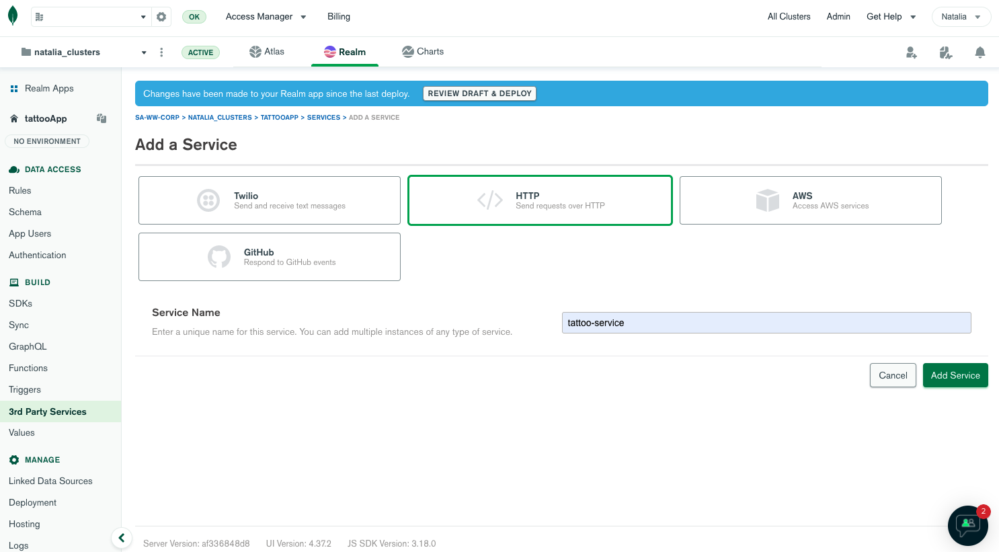
**(HTTP 3rd Party services are now called HTTPs Endpoints)**

We will select

| Config Key | Value |
| --- | ----------- |
| Authentication method | System |
| Log function arguments | On |
| HTTP Method | GET |
| Request Validation |  No Additional Authentication |

And we will `Save Draft`. Once we do, the function editor will be open. Please copy and paste the code that you will find in 

You can test the function in the `Console`, directly in the Function Editor, with this code

```
exports({query: {term: 'Ale'}}, new HTTPResponse())
```
Good! Now don't forget to review and deploy!

This will give us an endpoint, to generate quite a few static pages. We can now go to Netlify, and create a project, build and deploy our code! You can copy the endpoint URL from the `Webhook's Setting` page.

You will have to go to your apps Scully [config] and replace the API url, with yours (all until the `?term=Donald%20McDonald` part!). Being that this is a publicly accessible URL, you can also paste it in your browser address bar to test it!

Instructions on how to build and deploy an Angular/Scully site can be found [here](https://www.netlify.com/blog/2019/12/17/building-an-angular-jamstack-app-with-scully/)

## Triggering a build and deploy to Netlify when data changes in the database!

Now this is great, you have a bunch o static pages that are more performant and SEO friendly...but what if you change data in your database? You will want your site to be rebuilt. And you can leverage the Netlify Incoming Hook for that. 

You can follow this [instructions](https://docs.netlify.com/configure-builds/build-hooks/) to generate it.

To trigger a new build, we will now create precisely that...a database trigger. For that, we will click on the `Triggers` tab, on the left side bar, and then on `Add Trigger`

For the configuration, we will select:

| Config Key | Value |
| --- | ----------- |
| Trigger Type | Database |
| Name | deployNetlifySite |
| Enabled | On |
| Event Ordering |  On (no need for parallel processing) |
| Link Data Source | _ We will choose our cluster_ |


Once the cluster is linked, we can continue with the configuration

| Config Key | Value |
| --- | ----------- |
| Trigger Source Details | Cluster Name | our cluster name |
| Trigger Source Details | Database Name | tattoonetwork |
| Trigger Source Details | Collection Name | opinions |
| Trigger Source Details | Operation Name | We tick `Insert` |

Other Config

| Config Key | Value |
| --- | ----------- |
| Full Document | On |
| Event Type | Function |

And in the function window, we will paste the code we can find [here](./db-trigger/db-trigger-insert.js)

Now we will browse our collections in Atlas or Compass, to navigate to the `opinions` collection, and we will insert a new comment. When you're done saving, your trigger should have initiated a new build and deploy!

